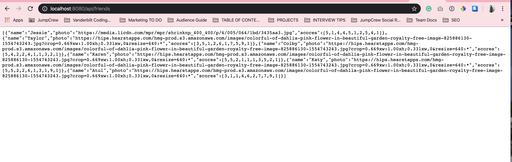

Jessie Taylor: Developer

Link to github repository: https://github.com/Jessiejtaylor/FriendFinder

Deployed Heroku app: https://frozen-basin-26714.herokuapp.com

This application is pairs you with a like-minded friend. The user answers 10 questions which get paired against the database of other users answers. To match friends, the app calculates the lowest difference in total scores. 

<b>App details:</b> 
This app uses Express to serve 2 static HTML files and 2 API routes to get and post data.

After cloning down the repo to your laptop, run npm install to download the Node dependencies. Then, be sure to serve the app in localhost:8080 in your browser.

<b>How To Use:</b> 
When you open the FriendFinder, you'll see initial instructions asking you to take a survey in order to be matched. 

<b>The Survey</b> 

When you click "Find a friend", the survey will open to display 10 questions. If you don't answer all 10 questions, the app will say, "Do us a favor and leave to stone left unturned. We'd hate to pair you with someone like Lindsday Lohan!".

(screenshot zoomed out for visibility)

After the user presses "Submit" at the bottom of the app, their "Best Match" will appear with the photo that they've uploaded for their profile. 

If you click on "API Friends List" at the bottom, all of the data from "previously taken quizzes" will be shown.

Lastly, if you click on "GitHub Repo", you will be taken to the GitHub repo where the FriendFinder code lives. 

